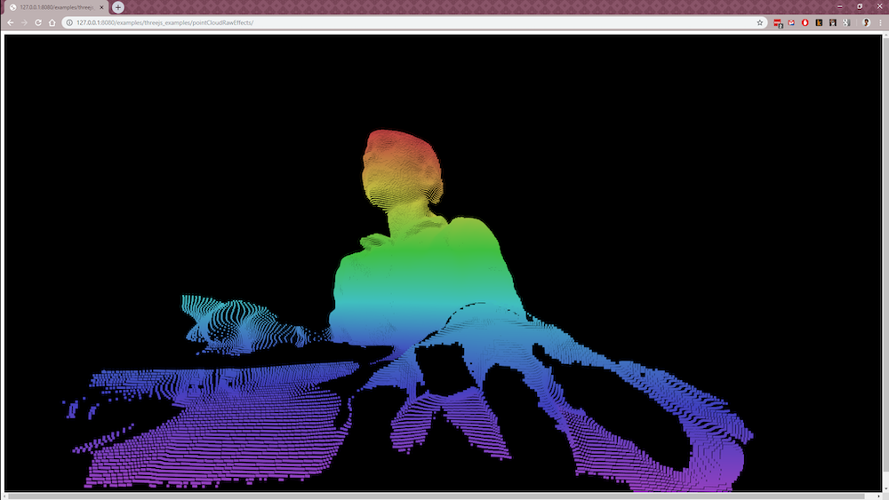

# Listen x Music x Tech Prototype



This project uses an Electron application to broadcast Kinect Azure depth data over a peer connection to the browser. It is currently only tested in Chrome.

Everything is built already. You shouldn't need to npm install, run or build anything not specified in the instructions below.

## To Run

## 1. Download and Run Server

You will need to be running Windows 10 and have the [Azure Kinect Camera SDK](https://docs.microsoft.com/en-us/azure/Kinect-dk/sensor-sdk-download) installed for the app to run correctly.

Download and unzip [release 0.0.1](https://github.com/lisajamhoury/listen-azure/releases/tag/0.0.1). Make sure you download the file that is labeled "xxxx.zip," not the files labeled "Source Code."

Once the file downloads, unzip the folder close to the C:\ drive level to avoid an error with Windows filename size limitations.

### 2. Connect Your Kinect

Plug in your Kinect Azure with a USB3 port to your PC.

### 3. Open the Electron Application

In the unzipped folder, double click on the application to begin running the server.

**Important!** When you run the application for the first time you will get a Windows Firewall warning. Allow for both private and public networks to connect.

If you accidently cancel out of the notification, you can access the Firewall Settings in the following way:

Navigate to Settings > Network & Internet > Windows Firewall > Allow an app or feature through Windows Firewall

1. Click "Change Settings" on top right
2. Find Electron in the list
3. Check all three boxes for Electron (Electron, Private, Public)
4. Click Ok.

### 4. Start Broadcasting!

Click on the "Depth Buffer" button to begin broadcasting the depth buffer feed. You will see the image appear on the screen.

You are now broadcasting your Kinect images! Woot!

### 5. Run Browser Three.js Example

1. In terminal clone the repository to your computer

```bash
git clone https://github.com/lisajamhoury/listen-azure.git
```

2. Move into folder and run a local server

```bash
cd listen-azure
# Run a simple python server on your localhost
# If python 2
python -m SimpleHTTPServer 8000
# If python 3
python -m http.server 8000
```

3. View example

Open Chrome and go to localhost:8000/examples/threejs_examples/pointCloudRawEffects

This example visualizes the depth buffer coming from the Kinect Azure using three.js.

Press 'b' to change background color.
