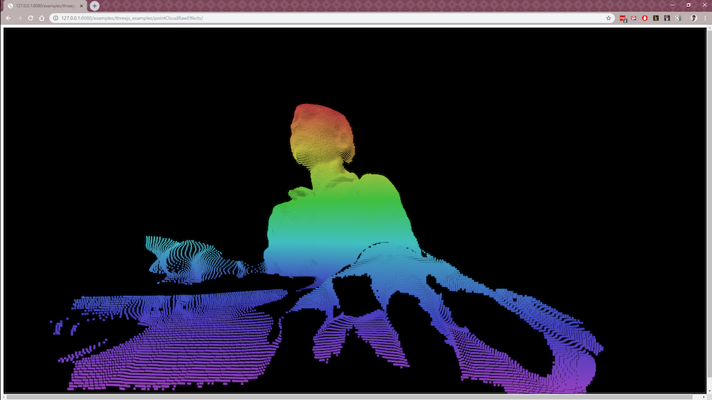

# Project Idea

Create an immersive connected experience that showcases the Azure Kinect’s abilities and is engaging and playful for the musician and audience.

## Keywords

Graphic, 3D, Dimensional, Depth, Interactive, Networked, Online, Bidirectional, Immersive, Surround

## Initial Ideas / Prototype

### Idea 1: Immersive Live Online Concert

Broadcast Azure Kinect depth data of a live “concert” to a website that visualizes the depth data in interesting ways. Audience members visiting the website have control over camera angle and visual effects.

Users either have control over their own view, or contribute to a shared view, in which all audience members are seeing the combination of each of the user's changes to the visualizations. (User testing needed to see which is a more satisfying experience.)

#### Option

If possible to get directional audio from the Azure Kinect 7-mic array, the experience can have immersive audio, where the user moves through the 3d scene and the sound changes based on position. This could be really interesting if there are multiple instruments or voices being broadcast. For example: a guitar, a vocalist and drums that the user can navigate between.

#### Option

Use two (or more) calibrated Kinects to create a wider depth view to be broadcast.

#### Tech

Use the open source tools node_kinect and Kinectron to bring the Azure Kinect into the browser and across networks. Build the experience in Three.JS in Chrome.

### Idea 2: Interactive Music “Video”

A similar experience to the above proposal, but rather than creating a live experience, use the Azure Kinect to create an online immersive music “video” for one song. All media would be pre-recorded and the website would be available to users at any time.

### Idea 3: Multi-location Interactive Concert

Same concept as above, but rather than broadcasting to online users, broadcast to specific locations that have full room projection and spatial audio. Musician(s) broadcast a live feed from one location. In the other locations, audience members can walk around a room and create different visual effects with the depth data and sound based on their position in the room. Audience member body position would be tracked with the Azure Kinect Body SDK.

## The Demo

Azure Kinect depth feed running in Electron and broadcast over the local network with webRTC/PeerJS to the browser. A website running three.js visualizes the point cloud. The user has two or three controls to change the point cloud visualization.

### Video: Prototype Website on Two Computers

Here's an example of what the prototype looks like when running the website on two computers on the same network.

<iframe src="https://player.vimeo.com/video/373044802" width="640" height="360" frameborder="0" allow="autoplay; fullscreen" allowfullscreen></iframe> 

### Video: Prototype Server and Website Startup

Here's a longer video that shows opening and running the Electron application and the client in the browser.

<iframe src="https://player.vimeo.com/video/373044904" width="640" height="360" frameborder="0" allow="autoplay; fullscreen" allowfullscreen></iframe>    

### Run the Prototype

Instructions to run the prototype are available at [https://github.com/lisajamhoury/listen-azure](https://github.com/lisajamhoury/listen-azure).

## Technical Issues

Currently I'm running into a lot of latency. The depth image is only able to broadcast reliably at 5-10 fps. There are a number of optimizations possible. The latency is only an issue for live usage. Not an issue for pre-recorded media.

## Additional Photos

